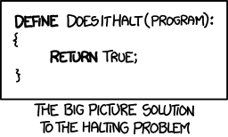

# ES6 Iterators in Depth
@author ---- Nicolás Bevacqua   
@translator（学号-姓名） ---- 31601365-石梦韬  
@date ---- 2019/06/06 20:00:00   

## 原文地址
@src ---- [https://ponyfoo.com/articles/es6-iterators-in-depth](https://ponyfoo.com/articles/es6-iterators-in-depthhttps://ponyfoo.com/articles/es6-iterators-in-depth)

## 翻译
这是[ES6深度版](https://ponyfoo.com/articles/tagged/es6-in-depth)的另一版。你是第一次来到这里的吗？热烈欢迎！到目前为止，我们讨论了[解构](https://ponyfoo.com/articles/es6-destructuring-in-depth)（*destructing*），[模板文字](https://ponyfoo.com/articles/es6-template-strings-in-depth)（*template literals*），[箭头函数](https://ponyfoo.com/articles/es6-arrow-functions-in-depth)（*arrow functions*），[扩展运算符和其余参数](https://ponyfoo.com/articles/es6-spread-and-butter-in-depth)（*spread operator and rest parameters*），对对象文字的改进，原型上的新[类型](https://ponyfoo.com/articles/es6-classes-in-depth)（*classes*）糖，以及关于[*``let``*，*``const``*和暂时性死区（*``Temporal Dead Zone``*）的文章](https://ponyfoo.com/articles/es6-let-const-and-temporal-dead-zone-in-depth)，当前的鸡汤是：**迭代器**  
**********************************

就像我在之前关于该系列文章中所说的那样，我想指出你应该可能[设置Babel](https://ponyfoo.com/articles/universal-react-babel#setting-up-babel)，并使用REPL或``babel-node`` CLI和文件来跟随这些示例。这将使您更容易**内化**本系列中讨论的**概念**。如果你不是在 *我的计算机上安装东西* 的那种人，你可能更喜欢登录[Code Pen](https://codepen.io)，然后点击JavaScript的齿轮图标， *他们有一个Babel的预处理器，这使得ES6变得轻而易举* 。另一个非常有用的替代方案是Babel的[在线REPL](https://babeljs.io/repl/) —— *它会在ES6代码右侧显示已编译的ES5代码，以便进行快速比较* 。   
     
在开始之前，如果你喜欢我的[ES6深度系列](https://ponyfoo.com/articles/tagged/es6-in-depth)，让我[*无耻地请求你的支持*](https://www.patreon.com/bevacqua)。你的贡献将有助于我跟上进度，服务器账单，保持我的饲料，并保持**Pony foo**作为一个真正的JavaScript好东西的来源。    
     
谢谢你听我说，不用再多费吹灰之力…… 好吗？

### 迭代器协议和可迭代协议
*************************
这里有许多新的、相互交织的术语。请原谅我，因为我把这些解释给忘了！
*************************

Javascript在ES6中获得了两个新协议：迭代器（*Iterators*）和（可迭代类型）（*Iterables*）。简单地说，您可以将协议视为约定。只要你在语言中遵循一个确定的惯例，你就会得到一个副作用。*Iterable*协议允许您在迭代JavaScript对象时定义行为。在JavaScript解释器和语言规范键盘粉碎机的世界深处，我们有 ``@@迭代器`` 方法。这个方法是[``Iterable``](https://developer.mozilla.org/en/docs/Web/JavaScript/Reference/Iteration_protocols)协议的基础，在现实世界中，您可以使用“众所周知的 ``symbol.iterator`` symbol”来分配它。   
    
我们将回到系列后面的符号。在失去焦点之前，你应该知道**每当一个对象需要被迭代**时，都会**调用一次** ``@@Iterator``（或*@@ iterator*） 方法。例如，在 [``for..of``](https://developer.mozilla.org/en/docs/Web/JavaScript/Reference/Statements/for...of) 循环的开头（*几分钟后我们也会回到这个循环*），将要求迭代器提供 ``@@Iterator``。返回的 *@@迭代器* 将用于从对象中获取值。      
    
让我们使用下面的代码片段作为支撑以理解迭代背后的概念。你要注意的第一件事是我通过 ``Symbol.iterator`` 属性赋予它神秘的 ``@@ iterator`` 属性，使我的对象成为可迭代的。我不能直接使用该符号作为属性名称。相反，我必须用方括号 ``[]`` 括起来，这意味着它是一个计算属性名称，其值为 ``Symbol.iterator`` *表达式* —— 正如您可能从[对象文字的文章](https://ponyfoo.com/articles/es6-object-literal-features-in-depth)中回忆的那样。分配给 ``[Symbol.iterator]`` 属性的方法返回的对象必须遵循*迭代器*协议。迭代器协议定义了如何从对象中获取值，并且我们必须返回一个遵循迭代器协议的 ``@@ iterator`` 。该协议表明我们必须有一个具有 ``next`` 方法的对象。 ``next`` 方法不带参数，它应该返回一个具有这两个属性的对象。   

⚪ ``完成（done）`` 信号表示序列在 ``true`` 时结束， ``false`` 表示可能有更多值   
⚪ ``值（value）`` 是序列中的当前项   

在我的示例中，迭代器方法返回一个对象，该对象具有有限的项目列表，并且在没有任何项目之前会发出这些项目。 下面的代码是ES6中的可迭代对象。    
```
//【代码片段1】：
var foo = {
  [Symbol.iterator]: () => ({
    items: ['p', 'o', 'n', 'y', 'f', 'o', 'o'],
    next: function next () {
      return {
        done: this.items.length === 0,
        value: this.items.shift()
      }
    }
  })
}
```

要实际迭代对象，我们可以使用 ``for..of`` 。 那会是什么样子？ 见下文。 ``for..of`` 迭代方法在ES6中也是新的，它解决了针对JavaScript集合循环的永久性战争，并随机查找不属于您期望的结果集的内容。

```
//=> 结果：
for (let pony of foo) {
  console.log(pony)
  // <- 'p'
  // <- 'o'
  // <- 'n'
  // <- 'y'
  // <- 'f'
  // <- 'o'
  // <- 'o'
}
```

您可以使用 ``for..of`` 迭代任何符合可迭代协议的对象。 在ES6中，包括数组，具有用户定义的 ``[Symbol.iterator]`` 方法的任何对象，[生成器](https://ponyfoo.com/articles/es6-generators-in-depth)（``generators``），来自[``.querySelectorAll``](https://developer.mozilla.org/en-US/docs/Web/API/Element/querySelectorAll)，DOM节点集合和朋友等。如果您只想将任何可迭代“转换”为数组，那么一对简洁替代品将使用[spread运算符](https://ponyfoo.com/articles/es6-spread-and-butter-in-depth)和 ``Array.from`` 。

```
//【代码片段2】：
console.log([...foo])
// <- ['p', 'o', 'n', 'y', 'f', 'o', 'o']
console.log(Array.from(foo))
// <- ['p', 'o', 'n', 'y', 'f', 'o', 'o']
```

回顾一下，我们的 ``foo`` 对象通过为 ``[Symbol.iterator]`` 分配方法来遵守*可迭代*（``Iterable``）协议 - 在 ``foo`` 的原型链中的*任何地方都可以工作*。 这意味着该对象是**可迭代的**：它可以被迭代。 所述方法返回遵循迭代器协议的对象。 每当我们想要开始遍历对象时，就会调用迭代器方法一次，并且返回的**迭代器**用于从foo中提取值。 要遍历迭代（*iterables*），我们可以使用 ``for..of``，[spread 运算符](https://ponyfoo.com/articles/es6-spread-and-butter-in-depth)或 ``Array.from`` 。

### 这是什么意思呢？   
本质上，关于迭代协议，``for..of``，``Array.from``和扩展运算符的卖点是它们提供了表达方式，可以毫不费力地迭代集合和数组（*例如 ``参数``（arguments） *）。 能够定义任何对象的迭代方式是巨大的，因为它使任何像[lo-dash](https://ponyfoo.com/articles/es6-iterators-in-depth)这样的库能够在语言本身理解的协议下聚合 —— *迭代*（*Iterables*）。 这是非常*庞大*的。

> Lodash的链接包装器现在是一个迭代器并且可以迭代:     
> var w = _({ a: 1, b: 2 });    
> Array.from(w); // => [1, 2]    
> —— John-David Dalton (@jdalton) [August 31, 2015](https://twitter.com/jdalton/status/638238228869283841)

给你另外一个例子，还记得我总是抱怨jQuery包装器对象不是[真正的数组](http://ponyfoo.com/articles/how-to-avoid-objectprototype-pollution)，或者 ``document.querySelectorAll`` 如何不返回真正的数组？ 如果jQuery在其集合的原型上实现了迭代器协议，那么你可以执行类似下面的操作。

```
//【代码片段3】：
for (let item of $('li')) {
  console.log(item)
  // <- <li> 会包装在JQuert对象中
}
```

为什么会被包装？ 因为它更具表现力。 您可以按需轻松迭代。

```
//【代码片段4】：
for (let list of $('ul')) {
  for (let item of list.find('li')) {
    console.log(item)
    // <- <li> 会包装在JQuert对象中
  }
}
```

这让我想到了迭代和迭代器的一个重要方面。

### 懒惰的特性
迭代器本质上是*懒惰*（*lazy*）的。 这可以说是这个序列一次只能访问一个项目。 它甚至可以是无限序列 —— 具有许多用例的合法场景。 鉴于迭代器是惰性的，让jQuery用它们的包装器对象包装序列中的每个结果都不会有很大的前期成本。 相反，每次从*迭代器*（*Iterator*）中提取值时都会创建一个*包装器*（*wrapper*）。  
     
无限迭代器看起来如何？ 下面的示例显示了一个具有 ``1..Infinity`` 范围的迭代器。 注意它永远不会产生 ``done：true`` ，表示序列结束。 尝试使用 ``Array.from(foo)`` 或 ``[... foo]`` 将可迭代的 ``foo`` 对象转换为数组会使程序崩溃，因为*序列永远不会结束*。 我们必须非常小心使用这些类型的序列，因为它们可能会崩溃并烧毁我们的Node进程或人类的浏览器选项卡。

```
//【代码片段5】：
var foo = {
  [Symbol.iterator]: () => {
    var i = 0
    return { next: () => ({ value: ++i }) }
  }
}
```

使用这种迭代器的正确方法是使用转义条件来阻止循环无限循环。 下面的例子使用 ``for..of`` 循环我们的无限序列，但是一旦值超过 ``10`` 就会中断循环。

```
//【代码片段6】：
for (let pony of foo) {
  if (pony > 10) {
    break
  }
  console.log(pony)
}
```

迭代器并不真正*知道*序列是无限的。 在这方面，这类似于[暂停问题](https://en.wikipedia.org/wiki/Halting_problem)（*halting problem*） —— 无法知道序列中的序列是否无限。

>    
> XKCD所描述的暂停问题   

我们**通常有一个不错的想法**关于序列究竟是有限的还是无限的，因为我们构造了这些序列。 每当我们有一个无限序列时，由我们来添加一个转义条件，确保我们的程序不会崩溃，试图循环遍历序列中的每个单独的值。

***********************************************************
明天回来我们将会[讨论生成器](https://ponyfoo.com/articles/es6-generators-in-depth)（*generators*）！
