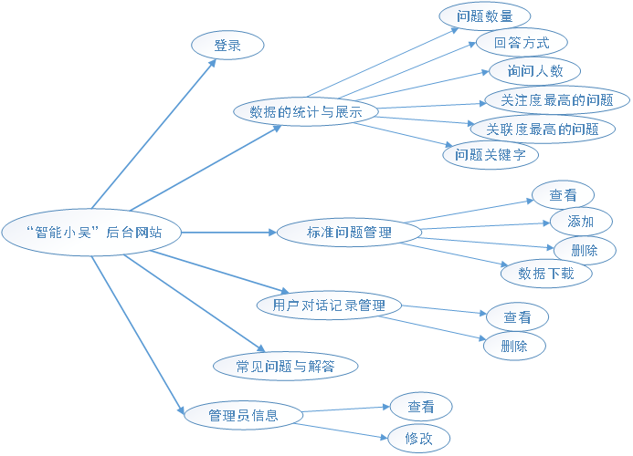

# 跨平台脚本开发技术大作业报告   

| 姓名 | 学号 | 班级 | 任务 | 权重 |
|------|-----|------|------|------|
|石梦韬|31601365|软工1601|所有任务|1.0|

***************************************
## 项目自评等级
|功能|分值|
|-----|----|
|函数式编程|5|
|xhr fetch api|5|
|FRP|1|
|Session Storage|5|
|响应式设计(Desktop/Tablet/Mobile)|5|
|Other|5|

## 项目说明
> **前导项目**——“智能小吴”(运用文本相似度实现（证券）智能客服)  
>   
>　　随着社会经济的发展，人力成本也愈发变得昂贵。对于企业，客服成本的支出的占比也不断变高。并且由于客服工作的枯燥性，使得客服职业的离职率居高不下，导致了企业的招工难问题。因此，一个智能的客服系统是亟待被开发的。  
>　　本客服系统不同于市面上的其他客服系统，本系统采用word2vec框架，使用了对于罕见词非常有利的skip-gram算法做词向量的生成。对于客服系统，必然是对某个特定领域流程的专精，本系统通过用户导入的领域内词汇，提高系统的相应词向量对应值得权重，使得该系统对于某一类特定领域的问题回答的准确度有了明显的提升。对于问题的匹配，该系统采用了余弦相识的排序方法，反馈排在前面的问题。对于未知的问题的回答，本系统在最高匹配项的余弦相似度低于域值时自动认为该问题不存在系统标准问题库中，会自动收网上收集相关信息，在整理后作为答案返回给用户。  
>　　目前已经通过了微信小程序的方式实现了在线问答智能客服：[点击查看智能客服微信小程序图片](https://zuccsecondary.cn/qa/src/%E6%99%BA%E8%83%BD%E5%AE%A2%E6%9C%8D.png)   

　　用户使用“智能小吴”中会产生大量的数据，为此需要做一个后台管理网站对这些数据进行分析和管理，这也是选择将“智能小吴”后台管理网站作为大作业项目的初衷。  

**【结构介绍】：**  
　　“智能小吴”后台网站结构图及各个模块功能说明如下：  
  
  

（1）**登录：**用户输入正确的账号与密码登录系统  
（2）**数据的统计与展示：**通过图表的形式，将储存在后台的数据展示来。具体有：  
> (A)``问题数量``：后台系统的标准问题数；  
> (B)``回答方式``：统计回答方式是“机器回答”还是“人工回答”的数量，来监测“智能小吴”是否真正的智能；  
> (C)``询问人数``：近十二个月使用“智能小吴”微信小程序的人数变化情况；  
> (D)``关注度最高的问题``：用户所询问的问题与数据库匹配次数最多的标准问题；  
> (E)``关联度最高的问题``：用户连续询问的两次问题，关联性次数最多的问题；  
> (F)``问题关键字``：系统标准问题的关键字分布情况。  

（3）**标准问题管理：**对数据库已经存在的标准问题及答案进行一个展示，支持对标准问题的添加、删除，以及数据下载操作。  
（4）**用户对话记录管理：**对用户与智能客服的对话记录的数据进行管理，对用户使用“智能小吴”过程中所产生的无关的对话记录，进行删除操作（例如问题为“123456”，答案为空的一条对话记录）。  
（5）**常见问题与解答：**展示管理员使用后台管理系统的过程中在碰到的常见问题以及标准回答的数据。  
（6）**管理员信息：**查看与修改管理员QQ、微信、邮箱与个人签名信息，对密码而言只能进行修改操作。  

**【其余说明】：**  
（1）项目是独立开发的，前端与后端都已经得到实现  
（2）项目后端采用node.js框架，通过mysql数据库对数据进行存储，对页面和后端的数据交互进行了实现  
（3）项目前端采用vue、bootstrap等框架，对于网站所用到的表格和统计图表，分别采用element和echart实现，表格和统计的图表数据均来源于后台mysql  
（4）前端支持响应式设计，适应不同宽度的页面，并且手机页面和网页页面展示的是不同的效果  
（5）目前后台管理网站已经部署到服务器上，访问[网址](https://zuccsecondary.cn/qa/visual/login.html)即可预览，需要登录网站需要通过email和31601365@stu.zucc.edu.cn进行沟通联系
  

## 解决技术要点说明
**【要点（1）：解决echart图表不能随着页面的缩放而缩放的问题】**   
**说明：**首页中的echart图表能够随着网页的缩放而自由地缩放   
**关键代码或步骤：**在echart的函数中，echart的属性设置好之后，函数的最后部分给window的resize（自由缩放）添加对应图表的``resize()``监听事件  
```
require({
	
}, function(){
	// 。。。 通过一个对象对图表进行设置
	window.addEventListener("resize", function() {
		myChart1.resize();
	});
})
```

**【要点（2）：实现从服务器动态得到echart图表的数据】**  
**说明：**刚开始实现的时候，echart的图表中的数据是静态数据，后来尝试着将服务器动态得到echart()中图表的数据，通过，了解``myChart2.setOption()``函数可以先后对同一张图表进行设置（原先认为``setOption``只能设置一次）  
**关键代码或步骤：**   
```
require({
	
}, function(){
	var option1 = { ... };       //标题等一些属性 
	myChart2.setOption(option1); //第一次设置属性
	var data = [...];            //echart中图表的数据
	myChart2.showLoading();      //加载显示条
	$.post(
		data = [...];            //通过向服务器发起post请求给data赋值
	);
	var option2 = { ... [含data]};//第二次设置属性（含动态获取的data）
	myChart2.hideLoading();      //隐藏显示条
})
```

**【要点（3）：解决当页面无限缩小时排版“特别乱”的问题】**  
**说明：**页面缩小时，页面排版会显得“特别乱”，见10.61.2.6  
**关键代码或步骤：**对body元素，css设置min-width属性，其最小宽度为一定值时，页面不再缩小，对于移动端，通过meta content="width=最小宽度 ..."的属性，设置手机页面的最小宽度  
```
<meta name="viewport" content="width=480, initial-scale=1, maximum-scale=1, user-scalable=no">
<style type="text/css">
	body{min-width:480}
</style>
```

**【要点（4）：解决表格字数太多而不好看的问题】**  
**说明：**解决在查看标准问题及答案、用户对话历史记录表格当中，例如标准问题的答案，字数太多表格显得太挤的问题。  
**关键代码或步骤：**对字数显示太多的问题，``el-table-column``中设置一个``<:show-overflow-tooltip="true">``的属性，来表示一行中，这一个单元格字数太多的时候，显示部分内容。再在表格中，增加一列，设置属性``type="expand"``，表示扩展箭头，然后在``el-table-column``里面通过``<template>``模板中写入具体展开的内容。  
```
<el-table>
	<el-table-column type="expand">
		<template scope="props">
			// ...... 展开记录显示的具体内容
		</template>
	</el-table-column>
	<el-table-column prop="answer" label="答案" :show-overflow-tooltip="true"></el-table-column>
</el-table>
```

**【要点（5）：解决管理员头像不能上传的问题】**  
**说明：**解决了管理员头像不能上传的问题。
**关键代码或步骤：**前端有一个正方形的图片容器，以及上传图片按钮/提交按钮，通过``input``将属性``type``将上传图片按钮设置成``file``属性，点击提交按钮，发起post请求，文件以及用户名通过``jquery``的``FormData()``格式的数据发送至后台服务器。后台服务器通过``formidable``的``IncomingForm()``方法建立文件流，将文件保存至指定路径下，并将路径保存至后台数据库中。


## 心得体会
### 大作业开发过程心得
　　js不仅可以实现前台的逻辑设计，也可以实现后台服务器的数据交互。在跨平台脚本开发技术这门课没有上之前，对于服务端怎么去做，只知道可以用php进行实现，上了这门课之后，对于后台服务器与前端的交互，又掌握node.js一种新的交互方式。  
　　在大作业的开发过程中，也用到了许多上课所提到的js技术，从前端方面到后端方面都有设计到，也可以证实跨平台脚本开发技术所学的知识是非常丰富的。  

### 本课程建议
（1）该课程作业量相对来说比其它课程要多，对于每周的作业，感觉可以适当地减少1-2个题目；还有生命游戏、马里奥平台游戏，虽然说作业完成时间有两周，该作业非常的有意思，但是在这两周时间内还要完成一些别的作业，这两周的任务跟其余时间相比非常重，可以适当考虑减轻一些作业量；  
（2）对一些附加作业，或者说有难度的常规作业，可以让已经做好的同学上台讲解，加平时分；  
   


